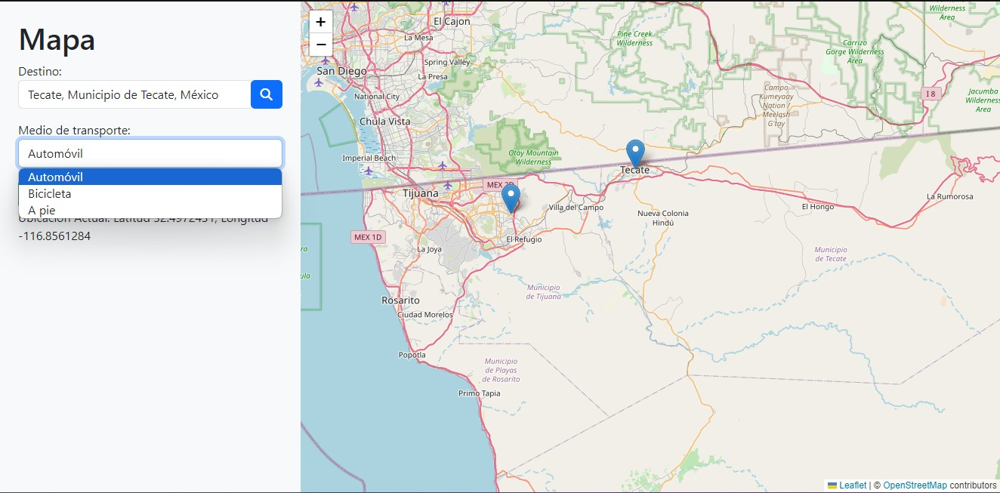
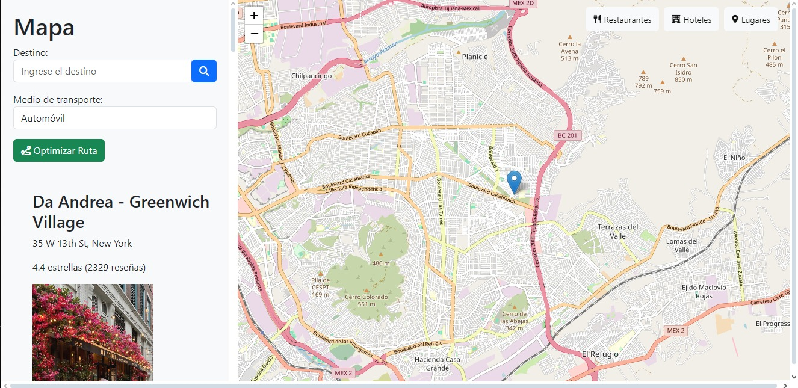

# **Aplicación de Optimización de Rutas**

Esta es una **aplicación web** diseñada para ayudar al viajero promedio a encontrar las mejores rutas para desplazarse entre sus destinos, ya sea en **auto**, **a pie** o **en bicicleta**. La aplicación proporciona rutas optimizadas y también ofrece información adicional sobre **restaurantes**, **estacionamientos** y **estaciones de tren** cercanas.

La aplicación utiliza varias **APIs** para ofrecer información en tiempo real y proporcionar la mejor experiencia al usuario. Entre las APIs utilizadas se encuentran **Yelp** (para recomendaciones de restaurantes), **Leaflet** (para mapas interactivos) y **Geocoder** (para convertir direcciones en coordenadas geográficas).

---

## 🌟 **Características Principales**
- **Búsqueda de Destinos**: Los usuarios pueden buscar sus destinos y ver información sobre ellos.
- **Optimización de Rutas**: Obtén rutas optimizadas para viajar en **auto**, **a pie** o **en bicicleta**.
- **Información Local**: Accede a recomendaciones de **restaurantes**, lugares para **aparcar** y estaciones de **tren** cercanas al destino.
- **Mapas Interactivos**: Usando **Leaflet**, se presentan mapas detallados para guiar a los usuarios.
- **Accesibilidad y Facilidad de Uso**: Interfaz limpia y fácil de usar, desarrollada en **React**.

---

##  **Vista Previa de la Aplicación**
### **Interfaz Principal**
La interfaz principal de la aplicación se muestra a continuación, despues de una busqueda de destino.


### **Mapa Interactivo**
La aplicación utiliza **Leaflet** para mostrar mapas interactivos con las rutas calculadas y los puntos de interés cercanos. A continuación, se muestran los distintos medios de transporte.



### **Información Local**
Los usuarios también verán información adicional sobre **restaurantes** cercanos, **estacionamientos** disponibles y **estaciones de tren**.



---

## ⚙️ **Requisitos del Sistema**
- **Navegador**: Compatible con Chrome, Firefox, Safari u Opera.
- **Node.js**: Versión 14 o superior.
- **Frameworks y Librerías**:
  - React
  - Leaflet.js (para mapas interactivos)
  - Geocoder (para geolocalización)
  - Yelp API (para obtener información de restaurantes y otros servicios)
  
---

## 🚀 **Instalación**
1. Clona este repositorio:
   ```bash
   git clone https://github.com/Fernanda3920/Transportes-Optimizados.git
